# Welcome to Hazelbean: Educational Learning Path

<div style="text-align: center; margin: 20px 0;">
  
  
  
</div>

## What is Hazelbean?

**Hazelbean** is a powerful Python library designed to make geospatial processing accessible, organized, and efficient. Whether you're a researcher analyzing land cover changes, a student learning geospatial concepts, or a professional building environmental models, Hazelbean provides the tools to:

- **Organize your workflows** with intelligent directory structures
- **Discover and load data** from multiple sources automatically  
- **Process raster data** with mathematical operations and transformations
- **Perform spatial analysis** with multi-raster operations and zonal statistics
- **Export professional results** with comprehensive documentation

### 🔄 Core Workflow Pattern

Hazelbean follows a consistent, organized workflow pattern that makes geospatial analysis predictable and reproducible:

```mermaid
graph TD
    A[🚀 Initialize ProjectFlow] --> B[📁 Create Directory Structure]
    B --> C[🔍 Discover & Load Data]
    C --> D[⚙️ Process & Transform]
    D --> E[🧮 Analyze & Compute]
    E --> F[📊 Export Results]
    F --> G[📝 Document & Share]
    
    A1[p = hb.ProjectFlow('project_name')] --> A
    B1[inputs/, intermediate/, outputs/] --> B
    C1[p.get_path() intelligent search] --> C
    D1[Array operations & transformations] --> D
    E1[Multi-raster analysis & statistics] --> E
    F1[Organized file structure] --> F
    G1[Automated documentation] --> G
    
    classDef stepBox fill:#e3f2fd,stroke:#1976d2,stroke-width:2px
    classDef codeBox fill:#f3e5f5,stroke:#7b1fa2,stroke-width:1px
    
    class A,B,C,D,E,F,G stepBox
    class A1,B1,C1,D1,E1,F1,G1 codeBox
```

### 🏗️ Detailed ProjectFlow Execution Model

Understanding how ProjectFlow coordinates complex geospatial workflows:

```mermaid
flowchart TD
    Start([ProjectFlow Initialize]) --> SetupCheck{Environment OK?}
    SetupCheck -->|No| Error[❌ Setup Error]
    SetupCheck -->|Yes| CreateDirs[📁 Create Directory Structure]
    
    CreateDirs --> RegisterPaths[🔗 Register Path Directories]
    RegisterPaths --> TaskRegistration[📝 Task Registration Phase]
    
    TaskRegistration --> TaskTree{Build Task Tree}
    TaskTree --> TaskDeps[⚙️ Resolve Dependencies]
    TaskDeps --> TaskExecution[🚀 Execute Task Tree]
    
    TaskExecution --> ParallelCheck{Parallel Tasks?}
    ParallelCheck -->|Yes| ParallelExec[⚡ Parallel Task Execution]
    ParallelCheck -->|No| SerialExec[🔄 Sequential Task Execution]
    
    ParallelExec --> TaskComplete
    SerialExec --> TaskComplete{Task Complete?}
    
    TaskComplete -->|No| ErrorHandle[🛠️ Error Handling]
    TaskComplete -->|Yes| NextTask{More Tasks?}
    
    ErrorHandle --> NextTask
    NextTask -->|Yes| TaskExecution
    NextTask -->|No| Finalize[✅ Finalize & Cleanup]
    
    Finalize --> Results[📊 Generate Results]
    Results --> Complete([🎉 Workflow Complete])
    
    %% Styling
    classDef process fill:#e3f2fd,stroke:#1976d2,stroke-width:2px
    classDef decision fill:#fff3e0,stroke:#f57c00,stroke-width:2px
    classDef error fill:#ffebee,stroke:#d32f2f,stroke-width:2px
    classDef success fill:#e8f5e8,stroke:#388e3c,stroke-width:2px
    
    class CreateDirs,RegisterPaths,TaskRegistration,TaskExecution,ParallelExec,SerialExec,Finalize,Results process
    class SetupCheck,TaskTree,ParallelCheck,TaskComplete,NextTask decision
    class Error,ErrorHandle error
    class Complete success
```



This workflow ensures that every analysis is:
- **🎯 Organized**: Clear directory structure and file management
- **🔄 Reproducible**: Consistent patterns and automated documentation  
- **🔍 Discoverable**: Intelligent file location and path resolution
- **📈 Scalable**: Efficient processing suitable for large datasets

## Learning Journey Overview

This educational system is designed for **progressive learning** - each step builds naturally on the previous ones. Complete the journey in order for the best experience.

### 🎯 Learning Objectives

By the end of this tutorial series, you will be able to:

1. **Initialize organized geospatial projects** using ProjectFlow
2. **Locate and load geospatial data** efficiently across multiple directories
3. **Process raster datasets** with mathematical operations and coordinate transformations
4. **Perform spatial analysis** combining multiple datasets and computing regional statistics
5. **Export professional results** with proper organization and documentation
6. **Apply Hazelbean patterns** to your own geospatial research and analysis

---

## 📚 Educational Resources

### 🚀 [Step-by-Step Tutorial Examples](examples.md)

**Perfect for:** First-time users, guided learning, hands-on practice  
**Time Commitment:** ~65 minutes total  
**Prerequisites:** Basic Python knowledge

Our comprehensive tutorial takes you through five progressive examples:

| Step | Focus Area | Time | Key Skills |
|------|------------|------|------------|
| **[Step 1](examples.md#step-1-project-setup)** | Project Setup | 5 min | ProjectFlow, Directory Structure |
| **[Step 2](examples.md#step-2-data-loading)** | Data Loading | 10 min | get_path(), File Discovery, Metadata |
| **[Step 3](examples.md#step-3-processing)** | Processing | 15 min | Array Operations, Transformations |
| **[Step 4](examples.md#step-4-analysis)** | Analysis | 20 min | Multi-raster Operations, Statistics |
| **[Step 5](examples.md#step-5-export-results)** | Export Results | 15 min | Professional Organization, Documentation |

!!! success "Why This Works"
    Each example includes complete, runnable code with extensive comments, error handling for missing data, and immediate visual feedback. The progression is carefully designed to introduce concepts incrementally.

### 🔬 [Test Documentation](../tests/index.md)

**Perfect for:** Understanding implementation details, advanced patterns, maintainers  
**Prerequisites:** Completion of tutorial examples  

Comprehensive test documentation organized by category, showing real-world usage patterns and edge cases.

### 📊 [Reports & Metrics](../reports/index.md)

**Perfect for:** Performance analysis, system status, quality metrics  
**Use Case:** Understanding system health and performance characteristics

---

## 🗺️ Learning Paths for Different Users

### 🌱 New to Hazelbean (Start Here!)

**Goal:** Get up and running quickly with guided examples

1. **Start:** [Tutorial Examples Step 1](examples.md#step-1-project-setup)
2. **Continue:** Follow the complete 5-step progression
3. **Practice:** Try modifying the examples with your own data
4. **Explore:** Browse test documentation for advanced patterns

**Estimated Time:** 1-2 hours including practice

### 🎓 Learning Geospatial Concepts

**Goal:** Understand both Hazelbean and geospatial processing concepts

1. **Background:** Familiarize yourself with raster data concepts
2. **Foundation:** Complete the tutorial examples with extra attention to spatial concepts
3. **Deep Dive:** Study the implementation details in test documentation
4. **Application:** Apply concepts to a small project in your domain

**Estimated Time:** 3-5 hours including background learning

### 🔬 Research & Analysis Focus

**Goal:** Efficiently apply Hazelbean to research workflows

1. **Quick Start:** Complete tutorial examples focusing on workflow patterns
2. **Adaptation:** Identify how patterns apply to your research domain
3. **Implementation:** Build your research workflow using Hazelbean patterns
4. **Optimization:** Use test documentation to understand performance characteristics

**Estimated Time:** 2-3 hours including adaptation

### 🔧 Contributing to Hazelbean

**Goal:** Understand the codebase for contribution and extension

1. **User Perspective:** Complete all tutorial examples
2. **Implementation Study:** Deep dive into test documentation and source code
3. **Architecture:** Review system architecture and design patterns
4. **Contribution:** Identify improvement opportunities and implementation approaches

**Estimated Time:** 5-10 hours depending on contribution scope

---

## 🛠️ Prerequisites & Setup

### System Requirements

=== "macOS"
    ```bash
    # Recommended: Use conda/mamba for environment management
    conda create -n hazelbean_env python=3.8+
    conda activate hazelbean_env
    conda install -c conda-forge hazelbean
    
    # Alternative: pip installation
    pip install hazelbean
    
    # macOS-specific: Install spatial libraries if needed
    brew install geos proj gdal
    ```
    
    **Common macOS paths:**
    - Home directory: `/Users/username/`
    - Default conda envs: `/opt/homebrew/Caskroom/mambaforge/base/envs/`
    - Example project path: `/Users/username/hazelbean_projects/`

=== "Windows" 
    ```cmd
    REM Recommended: Use conda/mamba for environment management
    conda create -n hazelbean_env python=3.8+
    conda activate hazelbean_env
    conda install -c conda-forge hazelbean
    
    REM Alternative: pip installation  
    pip install hazelbean
    
    REM Windows-specific: May need Visual C++ Build Tools
    REM Download from: https://visualstudio.microsoft.com/visual-cpp-build-tools/
    ```
    
    **Common Windows paths:**
    - Home directory: `C:\Users\username\`
    - Default conda envs: `C:\Users\username\miniconda3\envs\`
    - Example project path: `C:\Users\username\hazelbean_projects\`

=== "Linux"
    ```bash
    # Recommended: Use conda/mamba for environment management
    conda create -n hazelbean_env python=3.8+
    conda activate hazelbean_env
    conda install -c conda-forge hazelbean
    
    # Alternative: pip installation
    pip install hazelbean
    
    # Linux-specific: Install system dependencies if needed
    # Ubuntu/Debian:
    sudo apt-get install libgeos-dev libproj-dev libgdal-dev
    # CentOS/RHEL:
    # sudo yum install geos-devel proj-devel gdal-devel
    ```
    
    **Common Linux paths:**
    - Home directory: `/home/username/`
    - Default conda envs: `/home/username/miniconda3/envs/`
    - Example project path: `/home/username/hazelbean_projects/`

### Knowledge Prerequisites

!!! info "Required Knowledge"
    - **Python Fundamentals**: Variables, functions, basic data structures
    - **File System Concepts**: Understanding paths, directories, file operations
    
!!! tip "Helpful (Not Required)"
    - **NumPy Basics**: Array operations and indexing
    - **Geospatial Concepts**: Understanding of raster data, coordinate systems
    - **GIS Experience**: Familiarity with geospatial analysis workflows

### Validation Check

Test your setup by running this simple validation:

=== "macOS/Linux"
    ```python
    import hazelbean as hb
    import numpy as np

    # Create a simple test
    p = hb.ProjectFlow('setup_test')
    test_array = np.random.rand(10, 10)
    print(f"✅ Setup successful! Project directory: {p.project_dir}")
    print(f"✅ Array processing working: {test_array.shape}")
    
    # Expected output paths on Unix systems:
    # Project dir: /Users/username/setup_test (macOS)
    # Project dir: /home/username/setup_test (Linux)  
    ```

=== "Windows"
    ```python
    import hazelbean as hb
    import numpy as np

    # Create a simple test
    p = hb.ProjectFlow('setup_test')
    test_array = np.random.rand(10, 10)
    print(f"✅ Setup successful! Project directory: {p.project_dir}")
    print(f"✅ Array processing working: {test_array.shape}")
    
    # Expected output path on Windows:
    # Project dir: C:\Users\username\setup_test
    ```

If this runs without errors, you're ready to begin!

### 📁 Platform-Specific Project Organization

Understanding how Hazelbean organizes projects on your platform:

=== "macOS"
    ```
    📁 /Users/username/my_analysis/          # Project root
    ├── 📂 inputs/                          # Input data
    │   ├── rasters/
    │   └── vectors/
    ├── 📂 intermediate/                    # Processing files
    │   ├── aligned/
    │   └── processed/
    └── 📂 outputs/                        # Final results  
        ├── 20240117_analysis/
        └── reports/
    ```
    
    **Path handling:** Uses forward slashes, case-sensitive filesystem

=== "Windows" 
    ```
    📁 C:\Users\username\my_analysis\        # Project root
    ├── 📂 inputs\                          # Input data
    │   ├── rasters\
    │   └── vectors\
    ├── 📂 intermediate\                    # Processing files
    │   ├── aligned\
    │   └── processed\
    └── 📂 outputs\                        # Final results
        ├── 20240117_analysis\
        └── reports\
    ```
    
    **Path handling:** Uses backslashes, case-insensitive filesystem

=== "Linux"
    ```
    📁 /home/username/my_analysis/          # Project root
    ├── 📂 inputs/                          # Input data
    │   ├── rasters/
    │   └── vectors/
    ├── 📂 intermediate/                    # Processing files  
    │   ├── aligned/
    │   └── processed/
    └── 📂 outputs/                        # Final results
        ├── 20240117_analysis/
        └── reports/
    ```
    
    **Path handling:** Uses forward slashes, case-sensitive filesystem, supports symlinks

---

## 🎯 Quick Start Options

### 🚀 I want to dive right in!
    **→ [Start with Step 1 of the Tutorial](examples.md#step-1-project-setup)**

### 📖 I want to understand the big picture first
**→ Continue reading this page, then start the tutorial**

### 🔍 I want to see what's possible
    **→ [Jump to Step 5 (Results Export)](examples.md#step-5-export-results) to see the end goal**

### 💡 I have specific questions
**→ [Browse the Test Documentation](../tests/index.md) for detailed implementation patterns**

---

## 💡 Learning Tips for Success

!!! tip "Maximize Your Learning"
    
    **🔄 Learn by Doing**
    - Run every code example yourself
    - Modify parameters to see what happens  
    - Try using your own data files
    
    **📝 Take Notes**
    - Document patterns that apply to your work
    - Note functions and workflows you'll reuse
    - Keep track of useful parameter combinations
    
    **🔧 Experiment Safely**
    - Each example includes error handling
    - ProjectFlow creates organized directories for easy cleanup
    - Start small and gradually increase complexity
    
    **🤔 Think Beyond the Examples**
    - How would you apply these patterns to your domain?
    - What data would you use in each step?
    - What analysis questions would you ask?

!!! warning "Common Gotchas"
    
    **🗂️ File Paths**
    - Hazelbean uses intelligent path resolution, but understanding the search order helps
    - Use ProjectFlow methods rather than hardcoded paths
    
    **📊 Data Types**
    - Pay attention to raster data types and scaling factors
    - Always check coordinate reference systems when combining datasets
    
    **💾 Memory Management**  
    - Large raster datasets can consume significant memory
    - The examples show memory-efficient patterns

---

## 🎉 Ready to Begin?

The most effective way to learn Hazelbean is through hands-on practice. Our tutorial series is designed to get you productive quickly while building a solid foundation for advanced work.

<div style="text-align: center; margin: 30px 0;">
  <a href="examples/#step-1-project-setup" style="
    background: linear-gradient(45deg, #1976d2, #42a5f5);
    color: white;
    padding: 15px 30px;
    border-radius: 8px;
    text-decoration: none;
    font-weight: bold;
    font-size: 18px;
    display: inline-block;
    box-shadow: 0 4px 8px rgba(0,0,0,0.2);
    transition: transform 0.2s;
  " onmouseover="this.style.transform='translateY(-2px)'" onmouseout="this.style.transform='translateY(0)'">
    🚀 Start Learning with Step 1 →
  </a>
</div>

---

*This educational system is continuously updated to reflect the latest Hazelbean capabilities and best practices. Content is automatically extracted from working code examples to ensure accuracy and currency.*