# Welcome to Hazelbean Documentation

<div style="text-align: center; margin: 40px 0;">
  
  <br>
  
  
  
</div>

**Hazelbean** is a powerful Python library that transforms complex geospatial workflows into organized, reproducible, and efficient analysis pipelines. Whether you're a researcher, student, or professional working with geospatial data, Hazelbean provides the tools and structure to make your work more productive and reliable.

## 🎯 What Makes Hazelbean Special?

### 🏗️ **Intelligent Project Organization**
Hazelbean's `ProjectFlow` automatically creates and manages organized directory structures, making complex geospatial projects maintainable and shareable.

### 🔍 **Smart Data Discovery** 
The intelligent `get_path()` system finds your data across multiple directories, cloud storage, and data repositories without hardcoded paths.

### ⚡ **Efficient Processing**
Optimized raster processing with memory-efficient operations, parallel processing support, and performance tracking.

### 📚 **Educational Focus**
Comprehensive learning resources with progressive tutorials, extensive test documentation, and real-world examples.

## 🚀 Quick Start Options

<div style="display: grid; grid-template-columns: 1fr 1fr; gap: 20px; margin: 30px 0;">
  <div style="border: 2px solid #1976d2; border-radius: 8px; padding: 20px; background: linear-gradient(135deg, #e3f2fd, #f8f9ff);">
    <h3 style="color: #1976d2; margin-top: 0;">🎓 New to Hazelbean?</h3>
    <p><strong>Perfect for:</strong> First-time users, students, guided learning</p>
    <p><strong>Time:</strong> ~65 minutes of hands-on practice</p>
    <a href="educational/" style="
      background: linear-gradient(45deg, #1976d2, #42a5f5);
      color: white;
      padding: 10px 20px;
      border-radius: 5px;
      text-decoration: none;
      font-weight: bold;
      display: inline-block;
    ">Start Learning Journey →</a>
  </div>
  
  <div style="border: 2px solid #388e3c; border-radius: 8px; padding: 20px; background: linear-gradient(135deg, #e8f5e8, #f1f8e9);">
    <h3 style="color: #388e3c; margin-top: 0;">🔬 Technical Deep Dive</h3>
    <p><strong>Perfect for:</strong> Developers, maintainers, advanced users</p>
    <p><strong>Focus:</strong> Implementation details and patterns</p>
    <a href="tests/" style="
      background: linear-gradient(45deg, #388e3c, #66bb6a);
      color: white;
      padding: 10px 20px;
      border-radius: 5px;
      text-decoration: none;
      font-weight: bold;
      display: inline-block;
    ">Explore Test Docs →</a>
  </div>
</div>

<div style="display: grid; grid-template-columns: 1fr 1fr; gap: 20px; margin: 30px 0;">
  <div style="border: 2px solid #f57c00; border-radius: 8px; padding: 20px; background: linear-gradient(135deg, #fff3e0, #fffbf2);">
    <h3 style="color: #f57c00; margin-top: 0;">📊 Performance & Metrics</h3>
    <p><strong>Perfect for:</strong> Quality assessment, system monitoring</p>
    <p><strong>Content:</strong> Test results, benchmarks, system health</p>
    <a href="reports/" style="
      background: linear-gradient(45deg, #f57c00, #ffb74d);
      color: white;
      padding: 10px 20px;
      border-radius: 5px;
      text-decoration: none;
      font-weight: bold;
      display: inline-block;
    ">View Reports →</a>
  </div>
  
  <div style="border: 2px solid #7b1fa2; border-radius: 8px; padding: 20px; background: linear-gradient(135deg, #f3e5f5, #faf8fc);">
    <h3 style="color: #7b1fa2; margin-top: 0;">🔧 Site Information</h3>
    <p><strong>Perfect for:</strong> Understanding documentation system</p>
    <p><strong>Content:</strong> Site maintenance, contribution guidelines</p>
    <a href="https://github.com/jandrewjohnson/hazelbean_dev" style="
      background: linear-gradient(45deg, #7b1fa2, #ab47bc);
      color: white;
      padding: 10px 20px;
      border-radius: 5px;
      text-decoration: none;
      font-weight: bold;
      display: inline-block;
    ">GitHub Repository →</a>
  </div>
</div>

## 🌟 Featured Content

### 📖 Educational Journey

Our **progressive learning system** takes you from basic concepts to advanced geospatial analysis:

```mermaid
graph LR
    A[🚀 Setup & Installation] --> B[📁 Project Organization]
    B --> C[🔍 Data Discovery]
    C --> D[⚙️ Processing & Analysis]
    D --> E[📊 Results & Export]
    
    style A fill:#e3f2fd,stroke:#1976d2
    style B fill:#e8f5e8,stroke:#388e3c
    style C fill:#fff3e0,stroke:#f57c00
    style D fill:#f3e5f5,stroke:#7b1fa2
    style E fill:#e0f2f1,stroke:#00796b
```



**Perfect for:**
- 🎓 **Students** learning geospatial concepts
- 🔬 **Researchers** building analysis workflows  
- 👩‍💻 **Developers** understanding Hazelbean patterns
- 📊 **Analysts** creating reproducible processes

### 🧪 Comprehensive Test Documentation

Explore over **50+ test cases** that demonstrate real-world usage patterns:

| Category | Focus | Test Count | Coverage |
|----------|-------|------------|----------|
| **[Unit Tests](tests/unit.md)** | Individual functions | 9 modules | Core functionality |
| **[Integration Tests](tests/integration.md)** | Workflow testing | 4 modules | End-to-end processes |
| **[Performance Tests](tests/performance.md)** | Benchmarks & optimization | 3 modules | Efficiency tracking |
| **[System Tests](tests/system.md)** | Complete system validation | 2 modules | Smoke testing |


*Metrics updated automatically from latest test runs*

## 🎯 User-Focused Navigation

### 🌱 **For Beginners**
1. **[Start Here: Educational Overview](educational/index.md)** - Complete learning roadmap
2. **[Step 1: Project Setup](educational/examples.md#step-1-project-setup)** - Your first Hazelbean project
3. **[Step 2: Data Loading](educational/examples.md#step-2-data-loading)** - Intelligent data discovery

### 🔬 **For Researchers & Analysts** 
1. **[Integration Examples](tests/integration.md)** - Real-world workflow patterns
2. **[Performance Benchmarks](tests/performance.md)** - Optimization and efficiency
3. **[System Reports](reports/index.md)** - Quality metrics and monitoring

### 👩‍💻 **For Developers & Contributors**
1. **[Unit Test Patterns](tests/unit.md)** - Individual function testing
2. **[Architecture Overview](tests/index.md#test-architecture-overview)** - System design
3. **[Site Maintenance](https://github.com/jandrewjohnson/hazelbean_dev/blob/main/docs-site/README.md)** - Documentation system

## 🔍 Powerful Search & Discovery

This documentation site features **intelligent search** across all content types:

- 🔍 **Full-text search** across tutorials, tests, and documentation
- 🏷️ **Tagged content** for easy category filtering  
- 📱 **Mobile-responsive** design for on-the-go reference
- 🌓 **Light/dark themes** for comfortable reading
- 📋 **Code copy buttons** for easy example usage

**Search Tips:**
- Use specific function names (e.g., "get_path")  
- Search by concept (e.g., "raster processing")
- Filter by test category (e.g., "unit test")
- Look for error patterns (e.g., "file not found")

## ⚡ Quick Reference

### Essential Hazelbean Patterns

```python
import hazelbean as hb

# 1. Initialize organized project
p = hb.ProjectFlow('my_analysis')

# 2. Intelligent data discovery  
raster_path = p.get_path('land_cover.tif')

# 3. Efficient processing
result = hb.arrayframe_to_array(raster_path)

# 4. Organized output
output_path = p.get_path('processed_result.tif', 'output')
```

### Common Use Cases

| Task | Starting Point | Documentation |
|------|----------------|---------------|
| **Learn Hazelbean** | [Educational Journey](educational/index.md) | Progressive tutorials |
| **Process Rasters** | [Step 3: Processing](educational/examples.md#step-3-processing) | Array operations |  
| **Organize Projects** | [Step 1: Setup](educational/examples.md#step-1-project-setup) | ProjectFlow patterns |
| **Find Test Examples** | [Test Categories](tests/index.md) | Implementation patterns |
| **Check System Health** | [Reports](reports/index.md) | Metrics and monitoring |
| **Contribute to Project** | [GitHub Repository](https://github.com/jandrewjohnson/hazelbean_dev) | Development guide |

## 🎉 Ready to Get Started?

The most effective way to learn Hazelbean is through hands-on practice with our carefully designed tutorial progression.

<div style="text-align: center; margin: 40px 0;">
  <a href="educational/" style="
    background: linear-gradient(45deg, #1976d2, #42a5f5);
    color: white;
    padding: 20px 40px;
    border-radius: 10px;
    text-decoration: none;
    font-weight: bold;
    font-size: 20px;
    display: inline-block;
    box-shadow: 0 6px 12px rgba(0,0,0,0.2);
    transition: transform 0.2s;
  " onmouseover="this.style.transform='translateY(-3px)'" onmouseout="this.style.transform='translateY(0)'">
    🚀 Begin Your Hazelbean Journey
  </a>
</div>

<div style="text-align: center; margin: 30px 0;">
  <p style="color: #666; font-style: italic;">
    "Organized workflows, intelligent data discovery, efficient processing"
  </p>
</div>

---

<div style="display: flex; justify-content: space-between; align-items: center; margin: 40px 0; padding: 20px; background: #f5f5f5; border-radius: 8px;">
  <div>
    <strong>📚 Documentation System:</strong><br>
    Auto-generated from tests • Educational content • Live metrics
  </div>
  <div style="text-align: right;">
    <strong>🔄 Last Updated:</strong><br>
    <span id="last-updated">2025-01-17</span>
  </div>
</div>