# Hazelbean Test Documentation

Welcome to the comprehensive test documentation for Hazelbean. This section provides detailed information about the test architecture, test categories, and how to work with the test suite effectively.

## Test Architecture Overview

The Hazelbean test suite is organized into four main categories, each serving different purposes in ensuring code quality and system reliability:


## Test Development Workflow

The testing workflow follows Test-Driven Development (TDD) principles:


## Test Data Processing Pipeline

Understanding how test categories mirror the actual data processing workflow:

```mermaid
flowchart LR
    %% Data Flow
    Input[📥 Input Data] --> Load[📂 Data Loading]
    Load --> Validate[✅ Validation]
    Validate --> Transform[🔄 Transform]
    Transform --> Process[⚙️ Process]
    Process --> Analyze[📊 Analyze]
    Analyze --> Output[📤 Output Results]
    
    %% Test Categories
    Unit1[🧪 Unit Tests<br/>Load Functions] --> Load
    Unit2[🧪 Unit Tests<br/>Transform Functions] --> Transform
    Unit3[🧪 Unit Tests<br/>Process Functions] --> Process
    
    Integration1[🔗 Integration<br/>End-to-End Workflows] --> Validate
    Integration2[🔗 Integration<br/>Multi-step Pipelines] --> Analyze
    
    Performance[⚡ Performance<br/>Benchmarks] --> Process
    Performance --> Analyze
    
    System[🎯 System Tests<br/>Smoke & Validation] --> Input
    System --> Output
    
    %% Styling
    classDef dataFlow fill:#e3f2fd,stroke:#1976d2,stroke-width:2px
    classDef unitTest fill:#f3e5f5,stroke:#9c27b0,stroke-width:1px
    classDef intTest fill:#e8f5e8,stroke:#4caf50,stroke-width:1px
    classDef perfTest fill:#fff3e0,stroke:#ff9800,stroke-width:1px
    classDef sysTest fill:#fce4ec,stroke:#e91e63,stroke-width:1px
    
    class Input,Load,Validate,Transform,Process,Analyze,Output dataFlow
    class Unit1,Unit2,Unit3 unitTest
    class Integration1,Integration2 intTest
    class Performance perfTest
    class System sysTest
```



## Test Categories

### 🧪 [Unit Tests](unit.md)
- **Purpose**: Test individual functions and classes in isolation
- **Speed**: Fast (< 1 second per test)
- **Scope**: Single function or method
- **Dependencies**: Minimal, often mocked
- **Coverage**: 9 test modules covering core functionality

### 🔗 [Integration Tests](integration.md)  
- **Purpose**: Test component interactions and workflows
- **Speed**: Moderate (1-30 seconds per test)
- **Scope**: Multiple components working together
- **Dependencies**: Real components, test data
- **Coverage**: 4 test modules covering major workflows

### ⚡ [Performance Tests](performance.md)
- **Purpose**: Measure and track performance metrics
- **Speed**: Slow (30+ seconds per test)
- **Scope**: Execution time, memory usage, throughput
- **Dependencies**: Realistic datasets, baseline tracking
- **Coverage**: 3 main test modules plus baseline management

### 🎯 [System Tests](system.md)
- **Purpose**: Validate complete system behavior
- **Speed**: Fast to moderate (varies by test)
- **Scope**: End-to-end system validation
- **Dependencies**: Complete system installation
- **Coverage**: Smoke tests and system validation

## Running Tests

### Test Execution Methods

=== "Command Line (pytest)"
    ```bash
    # Activate environment
    conda activate hazelbean_env
    
    # Run all tests
    pytest hazelbean_tests/ -v
    
    # Run specific category
    pytest hazelbean_tests/unit/ -v
    pytest hazelbean_tests/integration/ -v
    pytest hazelbean_tests/performance/ -v
    pytest hazelbean_tests/system/ -v
    
    # Run with specific markers
    pytest hazelbean_tests/ -m "unit"
    pytest hazelbean_tests/ -m "integration" 
    pytest hazelbean_tests/ -m "performance"
    
    # Run specific test pattern
    pytest hazelbean_tests/ -k "test_get_path"
    ```

=== "IDE Integration"
    **VS Code with Python Extension:**
    1. Open Command Palette (Cmd+Shift+P / Ctrl+Shift+P)
    2. Select "Python: Configure Tests"
    3. Choose "pytest" as framework
    4. Set discovery path to `hazelbean_tests/`
    5. Use Test Explorer panel to run individual tests
    
    **PyCharm:**
    1. Right-click on `hazelbean_tests/` directory
    2. Select "Run 'pytest in hazelbean_tests'"
    3. Use green arrow icons next to test functions
    4. Configure run configurations for specific test categories
    
    **Jupyter/IPython:**
    ```python
    import subprocess
    import sys
    
    # Run specific test
    subprocess.run([sys.executable, '-m', 'pytest', 
                   'hazelbean_tests/unit/test_get_path.py::TestLocalFileResolution::test_file_in_current_directory', 
                   '-v'])
    ```

=== "CI/CD Pipeline"
    **GitHub Actions Example:**
    ```yaml
    name: Test Suite
    on: [push, pull_request]
    
    jobs:
      test:
        runs-on: ubuntu-latest
        steps:
        - uses: actions/checkout@v3
        - name: Setup Conda
          uses: conda-incubator/setup-miniconda@v2
          with:
            activate-environment: hazelbean_env
            environment-file: environment.yml
            
        - name: Run Tests
          shell: bash -l {0}
          run: |
            pytest hazelbean_tests/ -v --junitxml=test-results.xml
            
        - name: Run Performance Tests
          shell: bash -l {0}
          run: |
            pytest hazelbean_tests/performance/ --benchmark-json=benchmark.json
    ```
    
    **Local CI Simulation:**
    ```bash
    # Simulate CI environment locally
    conda env remove -n hazelbean_test_env
    conda env create -f environment.yml -n hazelbean_test_env
    conda activate hazelbean_test_env
    pytest hazelbean_tests/ --tb=short
    ```

### Advanced Test Execution

=== "Coverage & Reporting"
    ```bash
    # Generate comprehensive coverage report
    pytest hazelbean_tests/ \
        --cov=hazelbean \
        --cov-report=html \
        --cov-report=term-missing \
        --cov-report=xml
    
    # Generate test result reports
    pytest hazelbean_tests/ \
        --junitxml=test-results.xml \
        --html=test-report.html \
        --self-contained-html
    
    # Combined reporting
    pytest hazelbean_tests/ \
        --cov=hazelbean \
        --cov-report=html \
        --junitxml=test-results.xml \
        --html=test-report.html
    ```

=== "Performance & Benchmarking"
    ```bash
    # Run only benchmark tests
    pytest hazelbean_tests/performance/ --benchmark-only
    
    # Compare with previous benchmarks
    pytest hazelbean_tests/performance/ \
        --benchmark-compare=0001 \
        --benchmark-compare-fail=min:5% \
        --benchmark-compare-fail=max:10%
    
    # Save benchmark results
    pytest hazelbean_tests/performance/ \
        --benchmark-json=benchmark.json \
        --benchmark-save=baseline-$(date +%Y%m%d)
    
    # Memory profiling
    pytest hazelbean_tests/performance/ \
        --memray \
        --benchmark-columns=mean,stddev,median,ops,rounds
    ```

=== "Parallel & Distributed"
    ```bash
    # Parallel execution (automatic core detection)
    pytest hazelbean_tests/ -n auto
    
    # Specify number of workers
    pytest hazelbean_tests/ -n 4
    
    # Parallel with specific scope
    pytest hazelbean_tests/unit/ -n auto --dist=loadfile
    pytest hazelbean_tests/integration/ -n 2 --dist=loadscope
    
    # Load balancing for uneven test durations
    pytest hazelbean_tests/ -n auto --dist=loadscope
    
    # Distributed across multiple machines (advanced)
    # Machine 1:
    pytest hazelbean_tests/ --tx=ssh://user@machine2//python --rsyncdir=hazelbean_tests --dist=each
    ```

## Test Data Management

Tests use structured test data:

- **Unit Tests**: Minimal, often synthetic data
- **Integration Tests**: Realistic datasets from `hazelbean_tests/data/`
- **Performance Tests**: Standardized benchmarking datasets
- **System Tests**: Lightweight validation data

## Continuous Integration

The test suite is integrated with CI/CD pipelines:

- **Pre-commit**: Quick smoke tests
- **Pull Requests**: Full test suite execution
- **Performance Tracking**: Automated baseline comparison
- **Quality Gates**: Ensuring quality doesn't degrade

## Contributing to Tests

When contributing to Hazelbean:

1. **Write tests first** - Follow TDD principles
2. **Choose appropriate category** - Unit for isolated testing, integration for workflows
3. **Document test purpose** - Clear docstrings and comments
4. **Use existing patterns** - Follow established test conventions
5. **Validate performance impact** - Run performance tests for significant changes


---

## Next Steps

- Browse test categories using the navigation menu
- Review specific test modules for implementation details
- Run tests locally to validate your development environment
- Contribute new tests following the established patterns

For questions about testing or to report test-related issues, please refer to the project documentation or open an issue on GitHub.