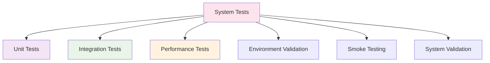

# System Tests

System tests validate the complete hazelbean system from a high-level perspective, ensuring that all components work together in realistic usage scenarios.

## Overview

The system test suite covers:

- **Smoke Testing** - Basic functionality verification
- **System Integration** - Verifying the complete system works as expected
- **Environment Validation** - Testing in different system configurations
- **End-to-End System Validation** - Complete system behavior testing

---

## Smoke Testing

Basic smoke tests that verify essential system functionality is working.

### System Validation Tests
::: hazelbean_tests.system.test_smoke

---

## Running System Tests

To run the complete system test suite:

```bash
# Activate the hazelbean environment
conda activate hazelbean_env

# Run all system tests
pytest hazelbean_tests/system/ -v

# Run smoke tests only
pytest hazelbean_tests/system/test_smoke.py -v

# Run with system-wide validation
pytest hazelbean_tests/system/ -v --tb=long
```

## Test Characteristics

System tests typically:

- **Test High-Level Behavior** - Focus on overall system functionality
- **Use Realistic Scenarios** - Test common usage patterns
- **Validate System Integration** - Ensure all components work together
- **Check Environment Compatibility** - Test across different system configurations
- **Provide Quick Feedback** - Fast execution for rapid validation

## System Validation

System tests validate:

- **Installation Integrity** - Verify the system is properly installed
- **Core Functionality** - Test that essential features work
- **Environment Compatibility** - Ensure the system works in target environments
- **Basic Workflows** - Validate common usage patterns
- **Error Handling** - Test system behavior under error conditions

## Troubleshooting

Common system test issues:

- **Environment Problems** - Missing dependencies or incorrect configuration
- **Installation Issues** - Incomplete or corrupted installation
- **System Configuration** - Incompatible system settings
- **Resource Availability** - Insufficient system resources

## System Requirements

System tests help validate that hazelbean works correctly with:

- **Operating Systems** - Windows, macOS, Linux
- **Python Versions** - Supported Python versions
- **Dependencies** - Required and optional dependencies
- **Hardware Configurations** - Different memory and CPU configurations

## Continuous Integration

System tests play a key role in CI/CD:

- **Pre-commit Validation** - Quick smoke tests before code commits
- **Build Verification** - Ensure builds produce working systems
- **Deployment Validation** - Verify deployed systems work correctly
- **Environment Testing** - Test across multiple environments

## Related Test Categories

- **Unit Tests** → Build from individual components in [Unit Tests](unit.md)
- **Integration Tests** → Extend workflow testing from [Integration Tests](integration.md)
- **Performance Tests** → Validate system performance in [Performance Tests](performance.md)

## System Validation Hierarchy



## Environment Matrix

System tests validate across:

| Environment | Components Tested | Validation Focus |
|-------------|------------------|------------------|
| **Development** | Core functionality | Feature completeness |
| **CI/CD** | Automated testing | Build integrity |
| **Production** | Full system | Deployment success |
| **Cross-platform** | OS compatibility | Platform support |

## Quick System Health Check

Run these commands for rapid system validation:

```bash
# Basic system health
pytest hazelbean_tests/system/test_smoke.py::test_basic_imports -v

# Environment validation  
pytest hazelbean_tests/system/test_smoke.py::test_core_functionality -v

# Full smoke test suite
pytest hazelbean_tests/system/ -v --tb=short
```
