# Hazelbean Performance Benchmarking & Quality Gates Reference

## Table of Contents
- [Quick Command Reference](#quick-command-reference)
- [Performance Benchmark Generation](#performance-benchmark-generation)
- [Regression Testing](#regression-testing)
- [Data Flow & Architecture](#data-flow--architecture)
- [File Structure & Outputs](#file-structure--outputs)
- [GitHub Actions Integration](#github-actions-integration)
- [Machine Consistency](#machine-consistency)
- [Troubleshooting](#troubleshooting)

---

## Quick Command Reference

### Essential Commands
```bash
# Activate environment (ALWAYS run this first)
conda activate hazelbean_env

# 🚀 RECOMMENDED: Complete end-to-end workflow
python scripts/run_performance_benchmarks.py --complete-workflow --runs 3

# Generate new performance baseline
python scripts/run_performance_benchmarks.py --establish-baseline --runs 3 --verbose

# Check for regressions (10% threshold)
python scripts/run_performance_benchmarks.py --check-regression --threshold 10.0 --verbose

# Generate performance reports
python scripts/run_performance_benchmarks.py --report --verbose

# Run individual performance tests
python -m pytest hazelbean_tests/performance/test_benchmarks.py -v -s
```

### Advanced Commands
```bash
# Run specific benchmark categories (uses corrected test paths)
python scripts/run_performance_benchmarks.py --tiling --verbose           # Runs test_benchmarks.py + test_functions.py
python scripts/run_performance_benchmarks.py --path-resolution --verbose  # Runs test_benchmarks.py + test_functions.py  
python scripts/run_performance_benchmarks.py --integration --verbose      # Runs test_benchmarks.py::TestIntegrationScenarioBenchmarks
python scripts/run_performance_benchmarks.py --aggregation --verbose      # Runs test_workflows.py

# Custom regression threshold (5% instead of default 10%)
python scripts/run_performance_benchmarks.py --check-regression --threshold 5.0

# Parallel benchmark execution
python scripts/run_performance_benchmarks.py --all --parallel

# Individual file testing (for debugging)
python -m pytest hazelbean_tests/performance/test_benchmarks.py -v
python -m pytest hazelbean_tests/performance/test_functions.py -v
python -m pytest hazelbean_tests/performance/test_workflows.py -v

# Generate dashboard and CSV exports (organized output)
python scripts/create_benchmark_dashboard.py
python scripts/visualize_benchmarks.py
```

---

## Performance Benchmark Generation

### 1. Baseline Creation Process

**Purpose:** Establish performance baseline for future comparisons

**Command:**
```bash
conda activate hazelbean_env
python scripts/run_performance_benchmarks.py --establish-baseline --runs 5 --verbose
```

**What it does:**
1. Runs performance test suite 5 times for statistical accuracy
2. Calculates mean, median, standard deviation for each test
3. Captures system environment metadata (OS, Python version, commit ID)
4. Saves comprehensive baseline to `metrics/baselines/current_performance_baseline.json`
5. Archives previous baseline to `metrics/baselines/snapshots/`

**Output Example:**
```
✅ Baseline established and saved to: current_performance_baseline.json
🔗 Open baseline file: /path/to/metrics/baselines/current_performance_baseline.json
⏱️  Baseline establishment took: 973ms
```

### 2. Benchmark Execution

**Available Test Categories:**

| Category | Tests | Focus Area | Typical Duration | Location |
|----------|-------|------------|------------------|----------|
| **Core Benchmarks** | 13 tests | Simple operations, GetPath, Integration | ~0.01-0.4s per test | `test_benchmarks.py` |
| **Function Benchmarks** | 11 tests | GetPath functions, Path resolution, Tiling | ~0.0001-0.05s per test | `test_functions.py` |
| **Workflow Benchmarks** | 7 tests | Performance integration, Aggregation | ~0.1-0.5s per test | `test_workflows.py` |
| **Baseline Manager Tests** | 19 tests | Baseline system functionality | ~0.01-0.1s per test | `unit/test_baseline_manager.py` |

**Performance Test Suite Structure:**
```
hazelbean_tests/performance/
├── test_benchmarks.py           # Core benchmarks (13 tests: Simple, GetPath, Integration)
├── test_functions.py            # Function benchmarks (11 tests: GetPath, PathResolution, Tiling)
├── test_workflows.py            # Workflow benchmarks (7 tests: Performance Integration, Aggregation)
├── baseline_manager.py          # Regression detection logic
├── conftest.py                  # Test configuration
└── unit/
    └── test_baseline_manager.py # Baseline system tests (19 tests)

Total: 50 performance tests available
```

---

## Regression Testing

### 1. Manual Regression Detection

**Step-by-step Process:**

```bash
# Step 1: Ensure you have a current baseline
conda activate hazelbean_env
python scripts/run_performance_benchmarks.py --establish-baseline --runs 3

# Step 2: Make your code changes
# [Edit your code here]

# Step 3: Run regression check
python scripts/run_performance_benchmarks.py --check-regression --threshold 10.0 --verbose

# Step 4: Analyze results
# Check output for regression warnings
# Review generated reports in metrics/
```

**⚠️ IMPORTANT:** After recent test restructuring, the script now correctly targets:
- `hazelbean_tests/performance/test_benchmarks.py` (Core & Integration tests)
- `hazelbean_tests/performance/test_functions.py` (Function-level benchmarks) 
- `hazelbean_tests/performance/test_workflows.py` (Workflow & aggregation tests)
- Total: **50 performance tests** available across all files

### 2. Regression Detection Logic

**Threshold Calculation:**
```python
# Example: 10% regression threshold
baseline_time = 0.100  # seconds
current_time = 0.115   # seconds
regression_percent = ((current_time - baseline_time) / baseline_time) * 100
# regression_percent = 15% → REGRESSION DETECTED (exceeds 10% threshold)
```

**Regression Status Codes:**
- ✅ **No Regression:** Current performance within threshold
- ⚠️ **Warning:** Performance degraded but within acceptable range
- ❌ **Regression:** Performance exceeded threshold (10% slower)

### 3. Custom Thresholds

**Different thresholds for different operations:**

```bash
# Strict threshold for critical path operations (5%)
python scripts/run_performance_benchmarks.py --path-resolution --check-regression --threshold 5.0

# Relaxed threshold for I/O operations (15%)
python scripts/run_performance_benchmarks.py --tiling --check-regression --threshold 15.0
```

---

## Data Flow & Architecture

### 1. Benchmarking Pipeline

```mermaid
flowchart TD
    A[Code Changes] --> B[Run Performance Tests]
    B --> C[Generate Current Benchmarks]
    C --> D[Load Historical Baseline]
    D --> E[Compare Performance]
    E --> F{Regression Detected?}
    F -->|No| G[✅ Pass Quality Gate]
    F -->|Yes| H[❌ Fail Quality Gate]
    G --> I[Update Baseline]
    H --> J[Block PR/Deployment]
    I --> K[Archive Results]
    J --> K
```



### 2. Data Storage Architecture

```
metrics/
├── baselines/
│   ├── current_performance_baseline.json    # Active baseline
│   └── snapshots/                           # Historical baselines
│       ├── baseline_YYYYMMDD_HHMMSS_<commit>.json
│       └── [13+ historical snapshots]
├── benchmarks/                              # Raw benchmark data
│   ├── benchmark_YYYYMMDD_HHMMSS.json
│   └── [24+ benchmark files]
├── reports/                                 # Human-readable reports (ORGANIZED)
│   └── performance_report_YYYYMMDD_HHMMSS.txt
├── exports/                                 # CSV exports for analysis (ORGANIZED)
│   └── performance_export_YYYYMMDD_HHMMSS.csv
├── analysis/                               # Regression analysis data (ORGANIZED)
│   └── regression_check_YYYYMMDD_HHMMSS.json
├── archive/                                 # Archived data
├── errors/                                  # Error logs
└── samples/                                 # Sample data
```

### 3. Baseline Structure

**Key Components of Baseline JSON:**
```json
{
  "baseline_metadata": {
    "version": "2.0",
    "created_at": "2025-09-18T07:25:27.308300+00:00",
    "regression_threshold_percent": 10.0,
    "statistical_confidence": "95%"
  },
  "version_control_info": {
    "commit_id": "20a2ada7206800301e620c3e5008107e2b14a822",
    "branch": "main",
    "is_dirty": false
  },
  "system_environment": {
    "platform": {"system": "Darwin", "machine": "arm64"},
    "python_environment": {"version": "3.13.2"}
  },
  "performance_benchmarks": {
    "test_single_call_performance_local_file": {
      "mean_duration": 0.0001234,
      "median_duration": 0.0001200,
      "std_deviation": 0.0000050,
      "sample_size": 5,
      "confidence_interval_95": [0.0001180, 0.0001288]
    }
  }
}
```

---

## File Structure & Outputs

### 1. Generated Files

**After running `--complete-workflow`, you get organized subdirectories:**

| File Type | Location | Purpose | Retention |
|-----------|----------|---------|-----------|
| **Baseline** | `metrics/baselines/current_performance_baseline.json` | Current performance baseline | Permanent |
| **Snapshots** | `metrics/baselines/snapshots/` | Historical baselines | Permanent |
| **Benchmarks** | `metrics/benchmarks/` | Raw benchmark data | 90 days |
| **Reports** | `metrics/reports/performance_report_*.txt` | Human-readable analysis | 30 days |
| **CSV Export** | `metrics/exports/performance_export_*.csv` | Data for custom analysis | 30 days |
| **Analysis** | `metrics/analysis/regression_check_*.json` | Regression analysis data | 30 days |
| **Dashboard** | `benchmark_dashboard.html` | Interactive web dashboard | Manual cleanup |

### 2. Report Contents

**Performance Report Sample:**
```
================================================================================
HAZELBEAN PERFORMANCE BENCHMARK REPORT
================================================================================
Generated: 2025-09-18 07:43:17
Total benchmarks analyzed: 94

TILING OPERATIONS PERFORMANCE:
----------------------------------------
Number of tiling benchmarks: 3
Mean execution time: 0.0373s
Median execution time: 0.0377s
Min execution time: 0.0281s
Max execution time: 0.0460s
Standard deviation: 0.0089s

PERFORMANCE RECOMMENDATIONS:
----------------------------------------
Identified 7 benchmarks significantly slower than average:
  • Consider optimizing: test_medium_raster_tiling_benchmark
    Current: 0.0460s (Average: 0.0116s)

SUMMARY:
--------------------
Overall mean execution time: 0.0116s
Fastest benchmark: 0.0000s
Slowest benchmark: 0.4383s
================================================================================
```

### 3. CSV Export Structure

**Location:** `metrics/exports/performance_export_YYYYMMDD_HHMMSS.csv` ✅ **ORGANIZED**

**Columns in performance export:**
```csv
benchmark_name,category,duration_ms,timestamp,commit_id,branch
test_single_call_performance_local_file,path_resolution,0.123,2025-09-18T07:43:17,20a2ada7,main
test_multiple_calls_performance,path_resolution,0.456,2025-09-18T07:43:17,20a2ada7,main
test_array_operations_benchmark,core_operations,12.345,2025-09-18T07:43:17,20a2ada7,main
test_get_path_function_overhead,function_benchmarks,0.089,2025-09-18T07:43:17,20a2ada7,main
```

---

## GitHub Actions Integration

### 1. Current Quality Gate Configuration

**Location:** `.github/workflows/testing-quality-gates.yml`

**4-Tier Quality Gate System:**
1. **Infrastructure Validation** - Smoke tests
2. **Core Functionality** - Essential features  
3. **Integration Testing** - Cross-component workflows
4. **Performance Regression** - Benchmark comparison

### 2. Performance Gate Implementation

**Current Performance Gate (lines 205-260):**
```yaml
performance-regression:
  name: "Quality Gate 4: Performance Regression"
  runs-on: ubuntu-latest
  needs: core-functionality
  timeout-minutes: 15
  
  steps:
    - name: Run performance regression tests
      run: |
        # Quick performance validation
        python -m pytest hazelbean_tests/performance/test_benchmarks.py \
          -v --benchmark-only \
          --benchmark-json=performance-results.json \
          --tb=short || {
            echo "status=warning" >> $GITHUB_OUTPUT  
            echo "⚠️ Performance regression detected"
            # Don't fail - performance issues need investigation
          }
          
        # Establish baseline for main branch
        if [[ "${{ github.ref }}" == "refs/heads/main" ]]; then
          python scripts/run_performance_benchmarks.py --establish-baseline --runs 2
        fi
```

### 3. Making PRs Fail on 10% Regression

**Current Issue:** Performance warnings don't fail the build (by design)

**To make PRs fail on regressions, modify the workflow:**

```yaml
# Replace the existing performance-regression job with:
performance-regression:
  name: "Quality Gate 4: Performance Regression"
  runs-on: ubuntu-latest
  needs: core-functionality
  timeout-minutes: 15
  
  steps:
    - name: Checkout repository
      uses: actions/checkout@v4
      
    - name: Setup Mambaforge with hazelbean_env
      uses: mamba-org/setup-micromamba@v1
      with:
        environment-file: environment.yml
        environment-name: hazelbean_env
        cache-environment: true
        
    - name: Run performance regression tests with STRICT enforcement
      run: |
        echo "⚡ Running STRICT performance regression tests..."
        
        # Run regression check with 10% threshold - FAIL on regression
        python scripts/run_performance_benchmarks.py --check-regression --threshold 10.0 --verbose || {
          echo "❌ BLOCKING: Performance regression > 10% detected"
          echo "📊 Review performance report for details"
          echo "🛑 This PR cannot be merged until performance is restored"
          exit 1
        }
        
        echo "✅ Performance within acceptable limits"
        
    - name: Establish baseline for main branch
      if: github.ref == 'refs/heads/main' && github.event_name == 'push'
      run: |
        echo "📊 Establishing performance baseline for main branch..."
        python scripts/run_performance_benchmarks.py --establish-baseline --runs 3
        
    - name: Upload performance artifacts
      if: always()
      uses: actions/upload-artifact@v4
      with:
        name: performance-regression-results
        path: |
          metrics/performance_report_*.txt
          metrics/performance_export_*.csv
        retention-days: 90
```

### 4. Triggers & Branch Configuration

**Current Triggers:**
```yaml
on:
  push:
    branches: [ main, develop ]
  pull_request:
    branches: [ main, develop ]
```

**To include feature branches:**
```yaml
on:
  push:
    branches: [ main, develop, 'feature/*' ]
  pull_request:
    branches: [ main, develop ]
```

---

## Machine Consistency

### 1. Current Challenge

**Problem:** Different machines produce different performance results
- **Developer laptops:** Varying CPU, memory, OS configurations
- **GitHub Actions runners:** Ubuntu VMs with different specs over time
- **Result:** Inconsistent baselines and false regression alerts

### 2. Solution Options

#### Option A: Self-Hosted Runners (RECOMMENDED)

**Pros:**
- ✅ Consistent hardware across all runs
- ✅ Full control over environment
- ✅ Better performance (no VM overhead)
- ✅ Can use identical machines for dev/CI

**Setup:**
```yaml
# In .github/workflows/testing-quality-gates.yml
performance-regression:
  runs-on: self-hosted
  # OR
  runs-on: [self-hosted, linux, performance-testing]
```

**Requirements:**
- Dedicated machine(s) for CI
- GitHub runner software installed
- Consistent environment setup

#### Option B: Containerized Consistent Environment

**Use Docker for reproducible environments:**

```dockerfile
# Dockerfile.performance-testing
FROM continuumio/mambaforge:latest

# Lock CPU and memory settings
ENV OMP_NUM_THREADS=2
ENV MKL_NUM_THREADS=2
ENV NUMEXPR_NUM_THREADS=2

# Install environment
COPY environment.yml .
RUN mamba env create -f environment.yml

# Performance testing specific settings
ENV GDAL_DISABLE_READDIR_ON_OPEN=EMPTY_DIR
ENV GDAL_NUM_THREADS=1
ENV PYTHONHASHSEED=42  # Reproducible hashing

CMD ["/bin/bash"]
```

**GitHub Actions Integration:**
```yaml
performance-regression:
  runs-on: ubuntu-latest
  container:
    image: hazelbean/performance-testing:latest
    options: --cpus="2" --memory="4g"
  
  steps:
    - name: Run performance tests in controlled environment
      run: |
        conda activate hazelbean_env
        python scripts/run_performance_benchmarks.py --check-regression --threshold 10.0
```

#### Option C: Performance Normalization

**Relative performance testing:**

```python
# Instead of absolute times, use relative performance
def normalize_performance(current_time, baseline_time, system_factor=1.0):
    """
    Normalize performance based on system characteristics
    system_factor: adjustment based on CPU benchmarks
    """
    normalized_time = current_time / system_factor
    return normalized_time
```

### 3. Machine Consistency Implementation

**Recommended Approach:**

1. **Short-term:** Use GitHub Actions with locked runner types
```yaml
runs-on: ubuntu-22.04  # Lock specific OS version
```

2. **Medium-term:** Implement self-hosted runners
   - Set up dedicated CI machine
   - Use identical hardware specs for dev/CI
   - Install GitHub Actions runner software

3. **Long-term:** Hybrid approach
   - Self-hosted runners for performance testing
   - GitHub runners for other quality gates
   - Containerized environments for reproducibility

### 4. System Calibration

**CPU Performance Calibration:**
```bash
# Add system benchmarking to establish performance baseline
python -c "
import time
import numpy as np

# CPU benchmark
start = time.time()
result = np.random.rand(1000, 1000) @ np.random.rand(1000, 1000)
cpu_factor = time.time() - start
print(f'CPU Performance Factor: {cpu_factor:.4f}')
"
```

**Include in baseline metadata:**
```json
{
  "system_performance": {
    "cpu_benchmark_factor": 1.234,
    "memory_bandwidth_factor": 0.987,
    "io_performance_factor": 1.456
  }
}
```

---

## Troubleshooting

### 1. Common Issues

**Issue: `❌ Failed to generate current benchmark results`**
```bash
# Solutions:
1. Check conda environment is active
2. Verify pytest is installed: pip install pytest
3. Run tests individually: python -m pytest hazelbean_tests/performance/ -v
```

**Issue: Baseline files not found**
```bash
# Create initial baseline:
python scripts/run_performance_benchmarks.py --establish-baseline --runs 3
```

**Issue: GitHub Actions not triggering**
```bash
# Check branch configuration in .github/workflows/testing-quality-gates.yml
# Ensure your branch is included in the 'on:' section
```

### 2. Debugging Performance Issues

**Verbose Output:**
```bash
python scripts/run_performance_benchmarks.py --complete-workflow --verbose
```

**Individual Test Debugging:**
```bash
python -m pytest hazelbean_tests/performance/test_benchmarks.py::TestGetPathPerformance::test_single_call_performance_local_file -v -s
```

**Check System Resources:**
```bash
# Monitor during performance tests
htop  # CPU and memory usage
iotop # Disk I/O
```

### 3. Maintenance Commands

**Clean Old Reports (Updated Paths):**
```bash
# Clean organized subdirectories
find metrics/reports/ -name "performance_report_*.txt" -mtime +30 -delete
find metrics/exports/ -name "performance_export_*.csv" -mtime +30 -delete
find metrics/analysis/ -name "regression_check_*.json" -mtime +30 -delete

# Alternative: Clean entire subdirectories (careful!)
# rm -rf metrics/reports/* metrics/exports/* metrics/analysis/*
```

**Archive Baselines:**
```bash
# Manual baseline archival
cp metrics/baselines/current_performance_baseline.json metrics/baselines/snapshots/baseline_$(date +%Y%m%d_%H%M%S)_$(git rev-parse --short HEAD).json
```

**Reset Performance Data:**
```bash
# CAUTION: This removes all performance history
rm -rf metrics/benchmarks/*
rm -rf metrics/baselines/snapshots/*
# Re-establish baseline:
python scripts/run_performance_benchmarks.py --establish-baseline --runs 5
```

---

## Summary

Your performance benchmarking system is **production-ready** with recent improvements:

✅ **Comprehensive benchmark suite** (50 performance tests across 4 files)  
✅ **Automated regression detection** (configurable thresholds)  
✅ **Rich historical data** (24+ benchmark files, 13+ baselines)  
✅ **GitHub Actions integration** (4-tier quality gates)  
✅ **Organized file structure** (clean subdirectories for all outputs)  
✅ **Detailed reporting** (text reports, CSV exports, interactive dashboards)  
✅ **Version control integration** (commit tracking, branch awareness)  
✅ **Corrected test paths** (all 50 tests properly accessible)

**Key Improvements Made:**
- ✅ **Fixed broken test paths** from directory restructuring
- ✅ **Organized output structure** - no more file clutter
- ✅ **50 tests available** vs previous 13 broken tests
- ✅ **Clean metrics directory** with proper subdirectories

**To make PRs fail on 10% regression:** Modify the GitHub Actions workflow to exit with code 1 when `--check-regression` detects issues.

**For machine consistency:** Consider self-hosted runners or containerized environments for reproducible performance testing.

**Your quality gate system is sophisticated and ready for production use!** 🚀

---

## 🔧 Recent Fixes Applied (September 2025)

**Issue Discovered:** Script was using obsolete test paths from previous directory structure

**Problems Fixed:**
- ❌ **OLD BROKEN PATHS:** `hazelbean_tests/performance/benchmarks/test_simple_benchmarks.py`
- ❌ **OLD BROKEN PATHS:** `hazelbean_tests/performance/workflows/test_performance_aggregation.py`
- ❌ **NON-EXISTENT FUNCTION:** `test_path_resolution_benchmark`

**✅ NEW CORRECT PATHS:**
- `hazelbean_tests/performance/test_benchmarks.py` (13 tests)
- `hazelbean_tests/performance/test_functions.py` (11 tests)  
- `hazelbean_tests/performance/test_workflows.py` (7 tests)
- `hazelbean_tests/performance/unit/test_baseline_manager.py` (19 tests)

**✅ NEW CORRECT FUNCTIONS:**
- `test_array_operations_benchmark` (exists in TestSimpleBenchmarks)
- `test_get_path_function_overhead` (exists in TestGetPathFunctionBenchmarks)

**Result:** All 50 performance tests now properly accessible and functional for benchmarking and quality gates! 🎯

## 📁 Directory Organization Improvements (September 2025)

**Issue:** Export files were cluttering the main metrics directory

**Solution Applied:** Organized all exports into proper subdirectories:
- ✅ **Reports:** `metrics/reports/performance_report_*.txt`
- ✅ **CSV Exports:** `metrics/exports/performance_export_*.csv` 
- ✅ **Analysis Data:** `metrics/analysis/regression_check_*.json`
- ✅ **Clean main directory:** No more loose files in `/metrics/`

**Result:** Clean, organized file structure with proper categorization! 📂

---

## 📋 Complete Updated Guide Summary

### Current Working Commands (All Tested & Verified)
```bash
# ALWAYS activate environment first
conda activate hazelbean_env

# Complete end-to-end workflow (RECOMMENDED)
python scripts/run_performance_benchmarks.py --complete-workflow --runs 3

# Individual operations (all create organized outputs)
python scripts/run_performance_benchmarks.py --establish-baseline --runs 5
python scripts/run_performance_benchmarks.py --check-regression --threshold 10.0
python scripts/run_performance_benchmarks.py --all --report
python scripts/run_performance_benchmarks.py --tiling --verbose

# Direct test execution (for debugging)
python -m pytest hazelbean_tests/performance/test_benchmarks.py -v    # 13 tests
python -m pytest hazelbean_tests/performance/test_functions.py -v     # 11 tests  
python -m pytest hazelbean_tests/performance/test_workflows.py -v     # 7 tests
python -m pytest hazelbean_tests/performance/ -v                      # All 50 tests
```

### Current File Structure (Updated & Organized)
```
metrics/                                    # ✅ CLEAN main directory
├── baselines/
│   ├── current_performance_baseline.json   # Active baseline
│   └── snapshots/                          # 13+ historical baselines
├── benchmarks/                             # 24+ raw benchmark files
├── reports/                                # ✅ ORGANIZED performance reports
│   └── performance_report_YYYYMMDD_HHMMSS.txt
├── exports/                                # ✅ ORGANIZED CSV exports  
│   └── performance_export_YYYYMMDD_HHMMSS.csv
├── analysis/                               # ✅ ORGANIZED regression data
│   └── regression_check_YYYYMMDD_HHMMSS.json
└── [archive/, errors/, samples/]           # Supporting directories
```

### Test Coverage (Fixed & Verified)
- **Total Tests:** 50 performance tests (up from 13 broken tests)
- **Core Benchmarks:** 13 tests in `test_benchmarks.py` ✅
- **Function Benchmarks:** 11 tests in `test_functions.py` ✅  
- **Workflow Benchmarks:** 7 tests in `test_workflows.py` ✅
- **Baseline Manager:** 19 tests in `unit/test_baseline_manager.py` ✅
- **All test paths corrected and functional** ✅

### Key Capabilities
- ✅ **Baseline establishment** with statistical accuracy (multiple runs)
- ✅ **Regression detection** with configurable thresholds (5%, 10%, 15%)
- ✅ **Performance reports** with trend analysis and recommendations
- ✅ **CSV exports** for custom analysis and visualization
- ✅ **Interactive dashboards** (auto-opens in browser)
- ✅ **GitHub Actions integration** ready for CI/CD quality gates
- ✅ **Version control tracking** (commit IDs, branch info, system metadata)
- ✅ **Clean organized output** (no more file clutter)

Your performance benchmarking system is **fully operational and ready for production quality gates!** 🎯
