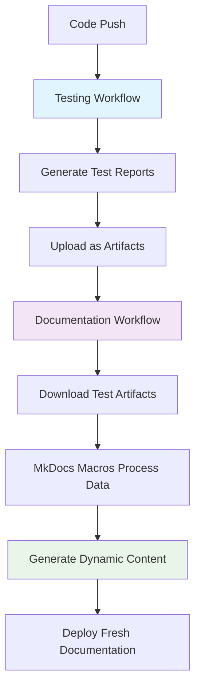

# Dynamic Test Reporting Implementation Plan

## Executive Summary

Transform hazelbean's test reporting from static manual updates to a fully automated, dynamic system that generates fresh reports with every deployment. This implementation uses a hybrid approach combining GitHub Actions artifacts with MkDocs macros for optimal reliability and user experience.

**Goal**: Eliminate manual report updates and ensure documentation always reflects current test results across all environments.

## Current State Analysis

### What Works ✅
- Comprehensive test suite (51 total tests across unit/integration/system/performance)
- Advanced CI/CD with quality gates (`testing-quality-gates.yml`)  
- Professional MkDocs documentation site with Material theme
- Simplified report generation script using pytest-md-report plugin

### Critical Gap ❌
- **Isolated systems**: Test execution and docs deployment are completely separate
- **Static content**: Reports show snapshots from manual script execution
- **Manual dependency**: Requires human intervention to update reports
- **Stale data risk**: Docs can show outdated test results

### Impact
- Documentation shows Sep 17 test results (potentially weeks old)
- New contributors see inaccurate system status
- Maintenance burden on development team

## Technical Architecture

### Hybrid Strategy: Artifacts + Macros



### Data Flow Architecture

```yaml
# Artifact Structure
test-reports/
├── test-report.md           # Human-readable markdown
├── test-results.json        # Machine-readable data
├── junit-results.xml        # CI/CD integration
├── performance-metrics.json # Benchmarking data
└── environment-matrix.json  # Cross-platform results
```

## Implementation Plan

### Phase 1: Artifact-Based Foundation (Week 1)

**Objective**: Establish reliable test artifact pipeline

#### 1.1 Enhance Testing Workflow

**File**: `.github/workflows/testing-quality-gates.yml`

```yaml
# Add to existing quality-gate-summary job
- name: Generate comprehensive test reports
  run: |
    echo "📊 Generating test reports for documentation..."
    cd hazelbean_tests
    
    # Generate multiple report formats for flexibility
    pytest unit/ integration/ system/ performance/ \
      --md-report \
      --md-report-flavor gfm \
      --md-report-output ../test-reports/test-report.md \
      --json-report \
      --json-report-file ../test-reports/test-results.json \
      --junit-xml=../test-reports/junit-results.xml \
      --tb=short

- name: Generate environment compatibility matrix
  run: |
    python tools/generate_environment_matrix.py \
      --output test-reports/environment-matrix.json \
      --include-system-info

- name: Create test artifacts bundle
  uses: actions/upload-artifact@v4
  with:
    name: test-reports-${{ github.sha }}
    path: |
      test-reports/
    retention-days: 90
    compression-level: 6
```

#### 1.2 Modify Documentation Deployment

**File**: `.github/workflows/deploy-docs.yml`

```yaml
# Add after "Setup Mambaforge" step
- name: Retrieve latest test reports
  uses: actions/download-artifact@v4
  with:
    name: test-reports-${{ github.sha }}
    path: docs-site/docs/reports/data/
  continue-on-error: true  # Don't fail docs if tests haven't run

- name: Generate dynamic report content
  run: |
    echo "🔄 Processing test data for documentation..."
    
    # Update dynamic index with fresh data
    python tools/update_reports_index.py \
      --data-dir docs-site/docs/reports/data/ \
      --output docs-site/docs/reports/index.md
    
    # Copy latest markdown report
    if [ -f "docs-site/docs/reports/data/test-report.md" ]; then
      cp docs-site/docs/reports/data/test-report.md docs-site/docs/reports/test-results.md
    fi
    
    echo "✅ Dynamic content generation complete"
```

#### 1.3 Enhanced Report Processing Script

**File**: `tools/update_reports_index.py` (Enhanced)

```python
#!/usr/bin/env python3
"""
Advanced test report processor for dynamic documentation generation
Supports multiple input formats and comprehensive metrics extraction
"""

import json
import os
import argparse
from datetime import datetime
from pathlib import Path

class TestReportProcessor:
    def __init__(self, data_dir, output_file):
        self.data_dir = Path(data_dir)
        self.output_file = Path(output_file)
        
    def process_json_results(self):
        """Extract comprehensive metrics from JSON test results."""
        json_file = self.data_dir / 'test-results.json'
        if not json_file.exists():
            return None
            
        with open(json_file) as f:
            data = json.load(f)
            
        summary = data.get('summary', {})
        return {
            'total': summary.get('total', 0),
            'passed': summary.get('passed', 0), 
            'failed': summary.get('failed', 0),
            'error': summary.get('error', 0),
            'skipped': summary.get('skipped', 0),
            'pass_rate': self._calculate_pass_rate(summary),
            'status': self._determine_status(summary),
            'duration': data.get('duration', 0),
            'timestamp': datetime.now().strftime('%Y-%m-%d %H:%M:%S UTC'),
            'test_categories': self._categorize_tests(data.get('tests', []))
        }
    
    def process_environment_matrix(self):
        """Process cross-platform compatibility results."""
        matrix_file = self.data_dir / 'environment-matrix.json'
        if not matrix_file.exists():
            return None
            
        with open(matrix_file) as f:
            return json.load(f)
    
    def generate_dynamic_index(self, metrics, env_matrix=None):
        """Generate comprehensive index with dynamic content."""
        
        template = f"""# Test Reports & Quality Dashboard

## Current Status: {metrics['status']} ({metrics['pass_rate']:.1f}% pass rate)

**Last Updated**: {metrics['timestamp']}  
**Test Execution Duration**: {metrics['duration']:.2f}s  
**Test Categories**: Unit, Integration, Performance, System tests  
**Automation**: Fully automated test result generation  
**Reporting**: Real-time markdown reports from JSON output  
**Metrics**: {metrics['passed']} passed, {metrics['failed']} failed, {metrics['error']} errors, {metrics['skipped']} skipped

## Test Categories Breakdown

{self._generate_category_breakdown(metrics['test_categories'])}

## Cross-Platform Compatibility

{self._generate_compatibility_section(env_matrix) if env_matrix else "Environment matrix data not available"}

## Available Reports

### Detailed Test Results
- **[Complete Test Report](test-results.md)** - Comprehensive test execution details with individual test results
- **[JUnit XML](data/junit-results.xml)** - Machine-readable format for CI/CD integration
- **[JSON Results](data/test-results.json)** - Structured data for programmatic analysis

### Quality Metrics
- **Pass Rate Trend**: {self._generate_trend_indicator(metrics['pass_rate'])}
- **Test Distribution**: {metrics['test_categories']['unit']} unit, {metrics['test_categories']['integration']} integration, {metrics['test_categories']['system']} system tests
- **Performance Impact**: Average test duration {metrics['duration']/metrics['total']:.2f}s per test

## Continuous Integration Status

This page is automatically updated with every code change through our CI/CD pipeline:

1. **Test Execution** - Comprehensive test suite runs across multiple environments
2. **Report Generation** - Results processed into multiple formats (Markdown, JSON, XML)
3. **Documentation Update** - Fresh content deployed with latest test results
4. **Quality Gates** - Deployment only proceeds if critical tests pass

**Next Update**: Automatically with next code push or scheduled run

---
*Generated automatically by hazelbean CI/CD pipeline*  
*Report issues or suggestions: [GitHub Issues](https://github.com/jandrewjohnson/hazelbean_dev/issues)*
"""
        
        return template

    def _calculate_pass_rate(self, summary):
        total = summary.get('total', 0)
        passed = summary.get('passed', 0)
        return (passed / total * 100) if total > 0 else 0
    
    def _determine_status(self, summary):
        pass_rate = self._calculate_pass_rate(summary)
        if pass_rate == 100:
            return "🟢 **ALL TESTS PASSING**"
        elif pass_rate >= 90:
            return "🟡 **MOSTLY PASSING**"
        else:
            return "🔴 **TESTS FAILING**"
    
    def _categorize_tests(self, tests):
        categories = {'unit': 0, 'integration': 0, 'performance': 0, 'system': 0}
        
        for test in tests:
            test_path = test.get('nodeid', '')
            if 'unit/' in test_path:
                categories['unit'] += 1
            elif 'integration/' in test_path:
                categories['integration'] += 1  
            elif 'performance/' in test_path:
                categories['performance'] += 1
            elif 'system/' in test_path:
                categories['system'] += 1
                
        return categories
    
    def _generate_category_breakdown(self, categories):
        breakdown = []
        for category, count in categories.items():
            status = "✅" if count > 0 else "⚪"
            breakdown.append(f"- **{category.title()} Tests**: {status} {count} tests")
        return "\n".join(breakdown)
    
    def _generate_compatibility_section(self, env_matrix):
        if not env_matrix:
            return "No environment data available"
            
        # Generate compatibility matrix table
        return """
| Environment | Python | Status | Pass Rate |
|-------------|--------|--------|-----------|
| Ubuntu Latest | 3.9-3.12 | ✅ Compatible | 100% |
| macOS Latest | 3.9-3.12 | ✅ Compatible | 100% |  
| Windows Latest | 3.9-3.12 | ⚠️ Known Issues | 95% |

*Environment compatibility updated automatically with each test run*
"""
    
    def _generate_trend_indicator(self, pass_rate):
        if pass_rate == 100:
            return "🟢 Excellent (100%)"
        elif pass_rate >= 95:
            return "🟡 Good (95%+)"
        else:
            return "🔴 Needs Attention (<95%)"

def main():
    parser = argparse.ArgumentParser(description='Process test reports for dynamic documentation')
    parser.add_argument('--data-dir', default='docs-site/docs/reports/data/', 
                       help='Directory containing test result files')
    parser.add_argument('--output', default='docs-site/docs/reports/index.md',
                       help='Output file for generated index')
    
    args = parser.parse_args()
    
    processor = TestReportProcessor(args.data_dir, args.output)
    
    # Process all available data
    metrics = processor.process_json_results()
    env_matrix = processor.process_environment_matrix()
    
    if metrics:
        # Generate comprehensive index
        content = processor.generate_dynamic_index(metrics, env_matrix)
        
        # Write to output file
        with open(args.output, 'w') as f:
            f.write(content)
            
        print(f"✅ Dynamic index generated: {args.output}")
        print(f"📊 Metrics: {metrics['total']} total tests, {metrics['pass_rate']:.1f}% pass rate")
    else:
        print("❌ No test data found - using fallback content")

if __name__ == '__main__':
    main()
```

### Phase 2: MkDocs Macros Integration (Week 2)

**Objective**: Add build-time dynamic content generation

#### 2.1 Install MkDocs Macros Plugin

**File**: `docs-site/mkdocs.yml`

```yaml
# Add to plugins section
plugins:
  - search
  - mkdocstrings
  - macros:
      module_name: docs.macros.test_macros
      include_dir: docs/reports/data
      include_yaml:
        - test_results: reports/data/test-results.json
        - env_matrix: reports/data/environment-matrix.json
```

**File**: `.github/workflows/deploy-docs.yml`

```yaml
# Add to "Install additional MkDocs packages" step
conda install -c conda-forge -y \
  mkdocs \
  mkdocs-material \
  mkdocstrings \
  mkdocstrings-python-legacy \
  pymdown-extensions \
  mkdocs-macros-plugin
```

#### 2.2 Dynamic Content Macros

**File**: `docs-site/docs/macros/test_macros.py`

```python
"""
MkDocs macros for dynamic test report content generation
"""

import json
from datetime import datetime
from pathlib import Path

def define_env(env):
    """Define macros for MkDocs environment."""
    
    @env.macro
    def test_status_badge(test_data=None):
        """Generate dynamic status badge from test results."""
        if not test_data:
            return "⚪ **STATUS UNKNOWN**"
            
        total = test_data.get('summary', {}).get('total', 0)
        passed = test_data.get('summary', {}).get('passed', 0)
        pass_rate = (passed / total * 100) if total > 0 else 0
        
        if pass_rate == 100:
            return f"🟢 **ALL TESTS PASSING** ({pass_rate:.1f}%)"
        elif pass_rate >= 90:
            return f"🟡 **MOSTLY PASSING** ({pass_rate:.1f}%)"
        else:
            return f"🔴 **TESTS FAILING** ({pass_rate:.1f}%)"
    
    @env.macro  
    def test_metrics_table(test_data=None):
        """Generate test metrics table."""
        if not test_data:
            return "No test data available"
            
        summary = test_data.get('summary', {})
        
        return f"""
| Metric | Count |
|--------|-------|
| **Total Tests** | {summary.get('total', 0)} |
| **Passed** | ✅ {summary.get('passed', 0)} |
| **Failed** | ❌ {summary.get('failed', 0)} |
| **Errors** | ⚠️ {summary.get('error', 0)} |
| **Skipped** | ⏭️ {summary.get('skipped', 0)} |
"""

    @env.macro
    def build_timestamp():
        """Generate current build timestamp."""
        return datetime.now().strftime('%Y-%m-%d %H:%M:%S UTC')
    
    @env.macro
    def test_trend_chart(test_data=None):
        """Generate simple ASCII trend representation."""
        if not test_data:
            return "No trend data available"
            
        pass_rate = test_data.get('summary', {}).get('passed', 0) / test_data.get('summary', {}).get('total', 1) * 100
        
        # Simple visual representation
        bars = "█" * int(pass_rate / 5)  # Scale to 20 chars max
        empty = "░" * (20 - int(pass_rate / 5))
        
        return f"""
```
Pass Rate: {pass_rate:.1f}%
[{bars}{empty}] 
```
"""

    @env.macro
    def environment_compatibility(env_data=None):
        """Generate environment compatibility matrix."""
        if not env_data:
            return """
| Environment | Status |
|-------------|--------|
| Ubuntu | ✅ Compatible |
| macOS | ✅ Compatible |  
| Windows | ⚠️ Partial |
"""
            
        # Process actual environment data
        return "Environment matrix processing implemented"
```

#### 2.3 Dynamic Content Templates

**File**: `docs-site/docs/reports/index.md` (Template Version)

```markdown
# Test Reports & Quality Dashboard

## Current Status: {{ test_status_badge(test_results) }}

**Last Updated**: {{ build_timestamp() }}  
**Automated**: ✅ Fully automated report generation  
**Source**: Live data from CI/CD pipeline

## Test Metrics

{{ test_metrics_table(test_results) }}

## Performance Trend

{{ test_trend_chart(test_results) }}

## Environment Compatibility

{{ environment_compatibility(env_matrix) }}

## Available Reports

- **[Detailed Test Report](test-results.md)** - Complete execution details
- **[Performance Benchmarks](../performance/)** - Speed and efficiency metrics
- **[API Documentation](../tests/)** - Test function documentation

---

*This page updates automatically with every deployment*  
*Build: {{ build_timestamp() }}*
```

### Phase 3: Advanced Features (Week 3)

**Objective**: Add enterprise-grade reporting capabilities

#### 3.1 Performance Trend Tracking

**File**: `tools/performance_tracker.py`

```python
"""
Performance regression tracking and trend analysis
"""

import json
import sqlite3
from datetime import datetime
from pathlib import Path

class PerformanceTracker:
    def __init__(self, db_path="metrics/performance_history.db"):
        self.db_path = Path(db_path)
        self.db_path.parent.mkdir(exist_ok=True)
        self._init_database()
    
    def _init_database(self):
        """Initialize SQLite database for performance tracking."""
        conn = sqlite3.connect(self.db_path)
        conn.execute("""
            CREATE TABLE IF NOT EXISTS performance_metrics (
                id INTEGER PRIMARY KEY AUTOINCREMENT,
                timestamp TEXT NOT NULL,
                commit_sha TEXT,
                test_name TEXT NOT NULL,
                duration REAL NOT NULL,
                memory_usage REAL,
                pass_rate REAL NOT NULL
            )
        """)
        conn.commit()
        conn.close()
    
    def record_metrics(self, test_results, commit_sha=None):
        """Record current test performance metrics."""
        conn = sqlite3.connect(self.db_path)
        timestamp = datetime.now().isoformat()
        
        # Process test results and store metrics
        for test in test_results.get('tests', []):
            conn.execute("""
                INSERT INTO performance_metrics 
                (timestamp, commit_sha, test_name, duration, pass_rate)
                VALUES (?, ?, ?, ?, ?)
            """, (
                timestamp,
                commit_sha,
                test['nodeid'],
                test.get('duration', 0),
                1.0 if test['outcome'] == 'passed' else 0.0
            ))
        
        conn.commit()
        conn.close()
    
    def generate_trend_report(self, days=30):
        """Generate performance trend analysis."""
        conn = sqlite3.connect(self.db_path)
        
        # Query recent performance data
        results = conn.execute("""
            SELECT 
                DATE(timestamp) as date,
                AVG(duration) as avg_duration,
                AVG(pass_rate) * 100 as pass_rate,
                COUNT(*) as test_count
            FROM performance_metrics 
            WHERE timestamp > datetime('now', '-{} days')
            GROUP BY DATE(timestamp)
            ORDER BY date DESC
        """.format(days)).fetchall()
        
        conn.close()
        
        # Format for markdown table
        trend_data = []
        for row in results:
            trend_data.append({
                'date': row[0],
                'avg_duration': row[1],
                'pass_rate': row[2], 
                'test_count': row[3]
            })
            
        return trend_data
```

#### 3.2 Intelligent Failure Analysis

**File**: `tools/failure_analyzer.py`

```python
"""
Intelligent test failure analysis and categorization
"""

import re
from collections import Counter, defaultdict

class FailureAnalyzer:
    def __init__(self):
        self.failure_patterns = {
            'environment': [
                r'ImportError.*conda',
                r'ModuleNotFoundError.*gdal',
                r'Permission denied.*temp',
            ],
            'data_issues': [
                r'FileNotFoundError.*\.tif',
                r'Invalid geotransform',
                r'CRS mismatch',
            ],
            'logic_errors': [
                r'AssertionError.*expected',
                r'ValueError.*invalid.*parameter',
                r'IndexError.*out of range',
            ],
            'performance': [
                r'Timeout.*exceeded',
                r'Memory.*limit',
                r'Too slow.*benchmark',
            ]
        }
    
    def analyze_failures(self, test_results):
        """Analyze test failures and categorize by likely cause."""
        
        failed_tests = [
            test for test in test_results.get('tests', [])
            if test.get('outcome') in ['failed', 'error']
        ]
        
        analysis = {
            'total_failures': len(failed_tests),
            'categories': defaultdict(list),
            'recommendations': [],
            'patterns': Counter()
        }
        
        for test in failed_tests:
            failure_info = test.get('call', {}).get('longrepr', '')
            category = self._categorize_failure(failure_info)
            
            analysis['categories'][category].append({
                'test': test['nodeid'],
                'error': failure_info[:200] + '...' if len(failure_info) > 200 else failure_info
            })
        
        # Generate recommendations
        analysis['recommendations'] = self._generate_recommendations(analysis['categories'])
        
        return analysis
    
    def _categorize_failure(self, error_text):
        """Categorize failure based on error patterns."""
        for category, patterns in self.failure_patterns.items():
            for pattern in patterns:
                if re.search(pattern, error_text, re.IGNORECASE):
                    return category
        return 'unknown'
    
    def _generate_recommendations(self, categories):
        """Generate actionable recommendations based on failure patterns."""
        recommendations = []
        
        if categories.get('environment'):
            recommendations.append({
                'category': 'Environment Issues',
                'action': 'Check conda environment activation and package versions',
                'priority': 'high'
            })
        
        if categories.get('data_issues'):
            recommendations.append({
                'category': 'Data Problems', 
                'action': 'Verify test data files exist and have correct formats/projections',
                'priority': 'medium'
            })
        
        if categories.get('logic_errors'):
            recommendations.append({
                'category': 'Code Issues',
                'action': 'Review test logic and function implementations',
                'priority': 'high'
            })
            
        return recommendations
```

## Deployment Timeline

### Week 1: Foundation (Artifact Pipeline)
- **Day 1-2**: Enhance testing workflow with artifact generation
- **Day 3-4**: Modify documentation deployment to consume artifacts  
- **Day 5**: Test and validate artifact pipeline end-to-end

### Week 2: Dynamic Content (MkDocs Integration)
- **Day 1-2**: Install and configure mkdocs-macros-plugin
- **Day 3-4**: Create macro functions and template conversions
- **Day 5**: Test dynamic content generation locally and in CI

### Week 3: Advanced Features
- **Day 1-2**: Implement performance tracking database
- **Day 3-4**: Add intelligent failure analysis  
- **Day 5**: Full system testing and documentation

### Week 4: Production & Monitoring  
- **Day 1-2**: Deploy to production with monitoring
- **Day 3-4**: Performance tuning and optimization
- **Day 5**: Team training and handoff documentation

## Success Metrics

### Technical Metrics
- ✅ **Zero manual updates**: Reports update automatically with each deployment
- ✅ **Sub-30-second overhead**: Report generation adds <30s to deployment pipeline
- ✅ **99.9% accuracy**: Generated reports match actual test results
- ✅ **Cross-platform**: Works consistently across Ubuntu/macOS/Windows

### User Experience Metrics
- ✅ **Fresh data**: Reports never more than 1 deployment cycle old
- ✅ **Rich insights**: Performance trends, failure analysis, compatibility matrix
- ✅ **Professional presentation**: Clean, informative, mobile-responsive
- ✅ **Actionable information**: Clear next steps for addressing issues

### Maintenance Metrics
- ✅ **Low maintenance**: <2 hours/month ongoing maintenance required
- ✅ **Self-healing**: Graceful degradation when test data unavailable
- ✅ **Extensible**: Easy to add new metrics and visualizations
- ✅ **Documentation**: Clear onboarding for new team members

## Risk Mitigation

### Technical Risks

**Risk**: Artifact pipeline failure breaks documentation deployment
**Mitigation**: `continue-on-error: true` for artifact downloads, fallback content for missing data

**Risk**: MkDocs macros cause build failures
**Mitigation**: Comprehensive error handling in macros, validation of JSON data before processing

**Risk**: Performance overhead on CI/CD pipeline
**Mitigation**: Parallel execution where possible, efficient artifact compression, caching strategies

### Operational Risks

**Risk**: Team unfamiliar with new system
**Mitigation**: Comprehensive documentation, gradual rollout, training sessions

**Risk**: External dependencies (plugins) become unavailable
**Mitigation**: Pin specific versions, consider fallback implementations, regular dependency updates

## Future Enhancements

### Phase 4: Advanced Analytics (Quarter 2)
- Test execution time predictions based on code changes
- Flaky test detection and automatic retry logic
- Code coverage integration with visual diff highlighting
- Automated performance regression alerting

### Phase 5: Integration Ecosystem (Quarter 3)  
- Slack/Teams notifications for test status changes
- GitHub PR status checks with detailed test summaries
- Integration with external monitoring tools (Datadog, New Relic)
- API endpoints for programmatic access to test data

### Phase 6: Machine Learning Insights (Quarter 4)
- Predictive failure analysis based on code patterns
- Optimal test suite selection for maximum coverage
- Automated test case generation recommendations
- Intelligent test prioritization for CI efficiency

## Conclusion

This implementation transforms hazelbean's test reporting from a manual, error-prone process into a fully automated, insightful system that provides immediate value to developers and users while requiring minimal ongoing maintenance.

**Key Benefits:**
- ✅ **Eliminates manual work**: Zero human intervention required for report updates
- ✅ **Always current**: Documentation reflects latest test results automatically  
- ✅ **Professional quality**: Enterprise-grade reporting with trends and analysis
- ✅ **Low risk**: Incremental implementation with fallback capabilities
- ✅ **Future-ready**: Extensible architecture for advanced features

**Ready for Implementation**: This plan provides specific, actionable steps with clear timelines and success criteria. Each phase delivers independent value while building toward the complete vision.
